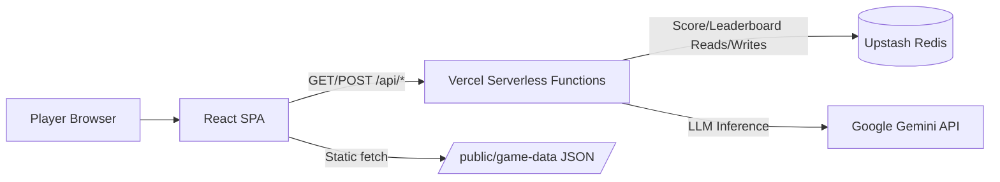
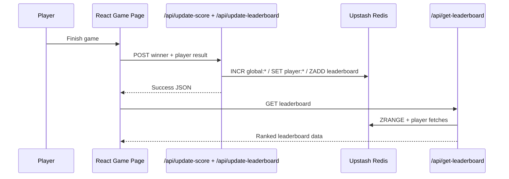
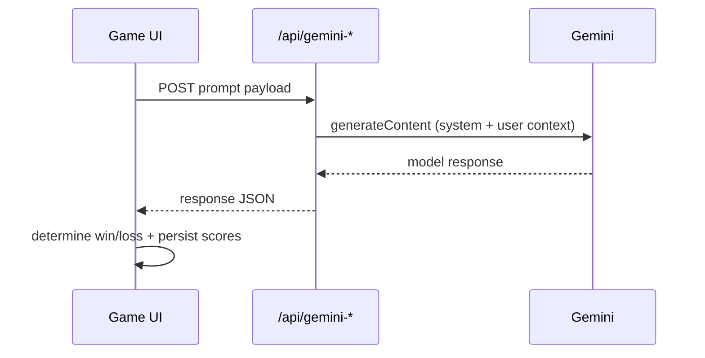

# 🤖 Beat The AI

> Browser-based human-vs-AI mini-game platform with persistent global scoring and player leaderboard.

Beat The AI is a Vite + React application that lets players compete against Gemini-powered challenges and track outcomes in Upstash Redis via Vercel serverless APIs. It combines arcade-style UX, lightweight session persistence, and production-friendly cloud primitives (serverless + managed Redis) for a deploy-fast game experience.


---

## 1) Hero Section

- **Project**: Beat The AI  
- **Value proposition**: Compete against AI reasoning games while tracking human-vs-AI performance globally.  
- **Summary**: A single-page game platform with four game modes, client-side session identity, serverless Gemini integrations, and Redis-backed global/player statistics.

## 2) Overview

Beat The AI provides four game loops:
- **Two Truths & a Hallucination** (knowledge filtering)
- **The Common Link** (association reasoning)
- **20 Questions** (AI-guided deductive guessing)
- **The Literal Genie** (prompt precision challenge)

It solves a practical problem for AI game prototypes: quickly shipping replayable AI interactions with persistent stats and minimal infrastructure management.

**Intended users**
- Players who want quick AI-vs-human challenges
- Developers evaluating Gemini-backed game UX patterns
- Teams shipping serverless game MVPs on Vercel

**Major capabilities**
- Cloud-persisted global win counters (humans vs AI)
- Player leaderboard ranking with wins, games played, win rate
- Real-time Gemini interactions for live modes
- Static puzzle packs for low-latency modes

## 3) Features

### Core platform
- Multi-game SPA with route guards based on active player session
- Persistent client state using Zustand + `persist`
- Daily session expiry behavior (localStorage expiry at midnight)

### Backend/API
- Serverless endpoints in `/api/*` for scoring, leaderboard, and Gemini calls
- Upstash Redis storage for global counters and sorted leaderboard
- CORS handling + OPTIONS support on API handlers

### Frontend
- React 19 + Router-based navigation
- Mobile-first, high-contrast neubrutalist-style UI
- Optimistic UX with loading states and progress bars

### AI capabilities
- Gemini-driven 20Q strategy flow with controlled output format
- Gemini-driven Literal Genie twist logic with win signal detection
- Additional Gemini puzzle generation endpoints exist for Two Truths/Common Link

### Infra/ops
- Vercel deployment with function memory/duration config (`vercel.json`)
- Static game data served from `/public/game-data/*.json`

### Analytics/admin-like behavior
- Global win-rate visualization
- Top-player ranking display with current-player highlighting

### Developer experience
- TypeScript across frontend
- ESLint + Vite build pipeline
- Minimal dependency footprint

## 4) Architecture

### High-level architecture


### Request/data flow (score + leaderboard)


### LLM gameplay flow (20Q/Genie)


**AI system notes**
- No RAG, embeddings, vector DB, agent orchestration, or long-term model memory are implemented.
- AI behavior is prompt-driven per request with short in-request conversational context.

## 5) Tech Stack

| Category | Stack |
|---|---|
| Frontend | React 19, React Router DOM 7, TypeScript, Zustand |
| Styling | Tailwind CSS, custom utility animation |
| Backend Runtime | Vercel Serverless Functions (Node-style handlers) |
| Database | Upstash Redis (`@upstash/redis`) |
| AI/ML | Google Gemini (`gemini-2.0-flash-exp`, `gemini-2.5-flash-preview-09-2025`) |
| Build Tooling | Vite 7, TypeScript compiler (`tsc -b`) |
| Linting | ESLint 9 + typescript-eslint + react hooks/refresh plugins |
| Deployment | Vercel (`vercel.json` rewrites + function config) |
| Auth/Identity | Client-side player identity (name + phone) persisted in localStorage |
| Integrations | Gemini API, Upstash Redis REST API |

## 6) Core Workflows

### A) Player session flow
1. User enters name + 10-digit phone on `/`.
2. Session object saved to localStorage with end-of-day expiry.
3. Protected routes (`/menu`, `/game/*`, `/leaderboard`, `/about`) require `playerName` in store.

### B) Game completion lifecycle
1. Game determines `playerWon`.
2. Local store updates game-specific played/win counters.
3. Frontend calls `/api/update-score` with `winner: human|ai`.
4. Frontend calls `/api/update-leaderboard` with name/phone/won/gameType.
5. UI refreshes global score + leaderboard from API.

### C) 20 Questions loop
1. User sets secret object.
2. Frontend requests AI questions from `/api/gemini-20q`.
3. User answers Yes/No/Maybe.
4. On final guess token (`FINAL GUESS:`), frontend computes win condition.

### D) Literal Genie loop
1. User submits wish (up to 3 attempts).
2. `/api/gemini-genie` returns twisted interpretation.
3. Win if model indicates wish is “perfect”.
4. Client-side hourly rate limit gate controls play frequency.

### E) Static puzzle loops
- Two Truths/Common Link currently read puzzles from static JSON in `public/game-data`.

## 7) Project Structure

```text
beat-the-ai/
├── api/                         # Vercel serverless endpoints
│   ├── gemini-20q.js            # 20Q Gemini orchestration (+ optional SSE)
│   ├── gemini-genie.js          # Literal Genie Gemini orchestration
│   ├── gemini-truths.js         # Dynamic puzzle generator (currently unused by UI)
│   ├── gemini-commonlink.js     # Dynamic puzzle generator (currently unused by UI)
│   ├── get-scores.js            # Global human/AI counters
│   ├── update-score.js          # Increment global score
│   ├── get-leaderboard.js       # Ranked leaderboard retrieval
│   └── update-leaderboard.js    # Player stats upsert + sorted-set ranking
├── public/game-data/            # Static puzzle datasets
├── src/
│   ├── components/              # Shared UI components
│   ├── pages/                   # Routes + game screens
│   ├── store/gameStore.ts       # Global state + API actions
│   └── main.tsx                 # App bootstrap
├── vercel.json                  # Rewrite + function runtime limits
├── .env.example                 # Environment variable template
└── package.json                 # Scripts and dependencies
```

## 8) API Documentation

### Base
- **Local**: `http://localhost:5173` (frontend); API proxied by Vercel/runtime environment
- **Style**: JSON REST endpoints in `/api`

### Authentication
- No server-side auth is enforced on public endpoints.
- Player identity is client-submitted (`name`, `phone`).

### Endpoints

| Endpoint | Method | Purpose |
|---|---|---|
| `/api/get-scores` | GET | Returns global `humans` and `ai` totals |
| `/api/update-score` | POST | Increments global score by winner |
| `/api/get-leaderboard` | GET | Returns ranked player list |
| `/api/update-leaderboard` | POST | Upserts player stats and rank |
| `/api/gemini-20q` | POST | Returns next AI question/final guess |
| `/api/gemini-genie` | POST | Returns genie interpretation + `playerWon` |
| `/api/gemini-truths` | POST | Returns generated Two Truths puzzle |
| `/api/gemini-commonlink` | POST | Returns generated Common Link puzzle |

### Example: update score
```http
POST /api/update-score
Content-Type: application/json

{ "winner": "human" }
```

```json
{
  "humans": 12,
  "ai": 9,
  "updated": "human"
}
```

### Example: update leaderboard
```http
POST /api/update-leaderboard
Content-Type: application/json

{
  "name": "Ada",
  "phone": "9999999999",
  "won": true,
  "gameType": "twentyQuestions"
}
```

## 9) AI/ML Section

- **Provider**: Google Gemini API
- **Live model usage**:
  - `gemini-2.0-flash-exp` for 20Q and Literal Genie
  - `gemini-2.5-flash-preview-09-2025` in puzzle-generation endpoints
- **Inference style**: Prompt + constrained output patterns
- **Context handling**: Short request-scoped history for 20Q
- **Not present**: Training pipeline, fine-tuning, embeddings, vector DB, personalized memory, evaluation framework

## 10) Security Considerations

Current implementation:
- Secrets sourced from environment variables
- Basic method guards and payload checks per endpoint
- No server-side auth/authorization for score APIs
- `Access-Control-Allow-Origin: *` on handlers
- Client-side rate limiting only (easy to bypass)

Production hardening recommendations:
- Add signed session tokens and server-side player identity checks
- Enforce server-side rate limiting (Redis TTL counters)
- Restrict CORS origins to trusted domains
- Add anti-abuse controls (bot detection, replay prevention)
- Avoid sending debug error details in non-dev responses

## 11) Installation & Setup

### Prerequisites
- Node.js 18+
- npm
- Gemini API key
- Upstash Redis database (REST URL + token)

### Clone and install
```bash
git clone https://github.com/alwayselse/beat-the-ai.git
cd beat-the-ai
npm install
```

### Environment
```bash
cp .env.example .env.local
```

Populate `.env.local` (and Vercel env vars) with required keys.

### Run locally
```bash
npm run dev
```

### Lint / build
```bash
npm run lint
npm run build
```

### Database setup
- No migrations required.
- Redis keys are created lazily by API writes.

### Docker
- No Dockerfile / docker-compose is currently included.

## 12) Environment Variables

| Variable | Required | Used by | Description |
|---|---|---|---|
| `GEMINI_API_KEY` | Yes (runtime) | `api/gemini-*.js` | Gemini API access key |
| `UPSTASH_REDIS_REST_URL` | Yes | score/leaderboard APIs | Upstash REST endpoint |
| `UPSTASH_REDIS_REST_TOKEN` | Yes | score/leaderboard APIs | Upstash REST auth token |
| `ADMIN_SECRET_KEY` | Optional currently | reserved | Mentioned in docs, not used by current API files |
| `VITE_GEMINI_API_KEY` | Not required by current app code | frontend env template | Present in `.env.example`, but frontend calls server APIs |

## 13) Deployment

Current deployment shape:
- **Platform**: Vercel
- **Frontend**: static Vite build
- **Backend**: serverless functions in `/api`
- **Routing**: SPA fallback rewrite `/(.*) -> /index.html`
- **Function limits**: 1024 MB memory, 10s max duration (`vercel.json`)

CI/CD:
- Git push to connected branch triggers Vercel build/deploy.

Scaling strategy:
- Horizontal scaling via serverless execution model
- Stateful data offloaded to managed Redis

## 14) Performance & Scalability

Implemented:
- Static puzzle datasets for low-latency rounds
- Short token caps in Gemini generation configs
- Redis sorted set for leaderboard ranking
- Serverless runtime avoids always-on backend cost

Gaps/opportunities:
- No response caching for repeated AI prompts
- Sequential leaderboard fetch path can grow latency with larger sets
- No queue/worker layer for heavy async workloads

## 15) Known Limitations

- Leaderboard and scoring endpoints are publicly writable.
- Player identity is not verifiable (name/phone is client-provided).
- Rate limits are client-side for game UX, not security.
- `gemini-truths` and `gemini-commonlink` APIs exist but are not wired into current gameplay screens.
- Repository currently has no license file despite prior README mention.
- Baseline lint currently fails due to an existing unused variable in `src/pages/EnterName.tsx`.

## 16) Future Improvements

- Server-enforced auth + per-player anti-cheat controls
- Redis-backed rate limiting and abuse monitoring
- Wire dynamic Gemini puzzle generation into Two Truths/Common Link as optional mode
- Add telemetry (game completion funnels, model latency, win-rate by mode)
- Add integration tests for API handlers and store actions
- Add CI checks and a formal LICENSE file

## 17) Contributing

1. Fork and create a feature branch.
2. Keep changes scoped and documented.
3. Run lint/build locally before opening PR.
4. Open a PR with:
   - problem statement
   - approach summary
   - test/validation output
   - screenshots for UI changes

Suggested local workflow:
```bash
npm install
npm run dev
npm run lint
npm run build
```

## 18) License

No `LICENSE` file is currently present in the repository. If you maintain this project, add an explicit license file to clarify reuse terms.

## 19) Author / Credits

- Repository owner: **[@alwayselse](https://github.com/alwayselse)**
- Built with: React, Vite, Gemini API, Upstash Redis, and Vercel
- Contributors: see Git history and pull requests
